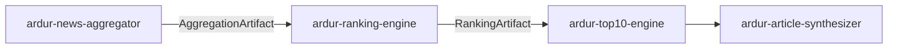

# ardur-ranking-engine

> **Stage 2 of the [Ardur AI content pipeline](./ARCHITECTURE.md).** The
> deterministic topic-rating engine. Consumes the
> [`AggregationArtifact`](https://github.com/ArdurAI/ardur-news-aggregator) and
> produces a `RankingArtifact` for
> [`ardur-top10-engine`](https://github.com/ArdurAI/ardur-top10-engine).

Implements the finalized Ardur topic-rating model (design:
`~/Documents/Ardur-AI-Website/news-rating-system.md`, mirrored in
[`docs/spec.md`](./docs/spec.md)). The model's **math is implemented and
unit-tested**; the data-extraction layer (owner-independence dedup, CVE/semver
parsing, engagement baselines) and per-artifact orchestration remain scaffold
stubs, tracked as issues.

## The model

For each **topic** (a cluster of independent articles about one story), every 6h:

```
Score = Recency(t) × [ 0.30·C + 0.28·T + 0.22·S + 0.20·E ] × Diversity
```

| Symbol | Signal | Definition |
|--------|--------|------------|
| **C** | Corroboration | `min(1, ln(1+n)/ln(1+8))`, `n` = independent source **owners** (not URLs), tier ≥ T3 |
| **T** | Technical significance | rules over CVE severity (KEV/CVSS/EPSS) / semver / release type; **+0.1** AI / platform-eng lean |
| **S** | Source tier | `0.7·maxTier + 0.3·meanTier` (T1 official 1.0 → T4 unknown 0.15) |
| **E** | Engagement | capped, baseline-normalized velocity (HN/GitHub/Reddit), **counts only**; necessary-not-sufficient |
| **Recency(t)** | multiplier ∈ (0,1] | `0.5^(t/H)`, `H = 12 + 24·T` h; `t` = age of the **freshest corroboration** (re-coverage resets decay) |
| **Diversity** | multiplier ∈ [0.8,1.15] | owner/type entropy; single-owner/single-type → echo penalty |

The four core weights sum to 1.0; with signals in [0,1] and the multipliers,
`Score ∈ [0, 1.15]`.

**Confidence** is separate from score and drives the editorial gate:

```
Confidence = 0.35·C + 0.30·tierConf + 0.20·cohesion + 0.15·agreement
   ≥ 0.66 → auto-publish   ·   0.40–0.66 → flagged (review badge)   ·   < 0.40 → editorial hold
```

## Why it's safe to run

- **Deterministic core, no paid API.** Every formula — corroboration curve,
  significance rules, tier blend, capped engagement, recency decay, diversity,
  confidence, the gate, and tie-breaks — is a pure function over metadata and
  public counts. Same inputs ⇒ same output.
- **LLM is optional enrichment only.** Sharper NER, near-dup merge, label/take
  polish. On budget exhaustion or failure the deterministic path still ships a
  complete, ranked Top-10.
- **Copyright-safe.** Operates on titles, source names, URLs, timestamps,
  extracted topic labels, and public counts — never article bodies.
- **Anti-gaming.** Owners-not-URLs dedup, per-platform velocity caps, a
  diversity echo-penalty, and "engagement alone can't reach the Top-10" (needs
  ≥2 independent owners **or** a Tier-1 primary).

## Pipeline position



## Output contract

`runRanking(aggregation)` returns a `RankingArtifact` (see
[`src/contracts.ts`](./src/contracts.ts)):

- `rankedByTopic` — `RankedCluster[]` per topic, sorted by score, each with a
  `ScoreBreakdown`, `sourceQuality`, `confidence`, `verification`, and `auditId`.
- `audit` — `AuditEntry[]`: the **lossless** record of every topic's rating
  (all four signals incl. **T**, both multipliers, weights, confidence) — anyone
  can recompute the score.
- `weightProfile` — the profile id+version applied (`balanced@v1`).

> **Contract note.** The shared `ScoreBreakdown` predates this model and has no
> typed slot for the Technical-significance *component value*. It is mapped
> faithfully (C/S/E + recency/diversity multipliers + all four weights), and the
> full breakdown including **T** is preserved losslessly in the audit `inputs`.
> A contract revision is tracked as an issue — the shared file is **not** edited
> in this repo.

## Project layout

| Path | Role |
|------|------|
| `src/contracts.ts` | Shared pipeline contract (identical across all 4 repos — do not edit here). |
| `src/weights.ts` | `WeightProfile` registry + `balanced@v1` (all tunable model config, pure data). |
| `src/signals.ts` | The model's pure signal transforms + cluster→signal extraction. |
| `src/score.ts` | Score combination, confidence + gate, tie-breaks, contract mapping. |
| `src/audit.ts` | Lossless, reproducible audit-entry construction. |
| `src/index.ts` | `runRanking()` entrypoint + public surface. |
| `src/cli.ts` | Rank an artifact from stdin/file. |
| `src/model.test.ts` | Conformance tests against the spec's worked values. |

## Getting started

```bash
npm install
npm run typecheck
npm test      # model conformance + smoke
npm run build
```

## License

MIT © 2026 ArdurAI
