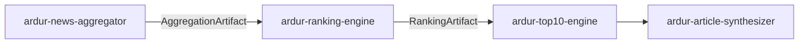

# ardur-ranking-engine

> **Stage 2 of the [Ardur AI content pipeline](./ARCHITECTURE.md).** Multi-signal
> scoring with a full audit trail. Consumes the
> [`AggregationArtifact`](https://github.com/ArdurAI/ardur-news-aggregator) and
> produces a `RankingArtifact` for
> [`ardur-top10-engine`](https://github.com/ArdurAI/ardur-top10-engine).

This repository is a **design specification + minimal scaffold**. Interfaces and
wiring are final; engine logic is intentionally unimplemented (every module
throws `not implemented`). See [`docs/spec.md`](./docs/spec.md) and
[`ARCHITECTURE.md`](./ARCHITECTURE.md).

## What it does

Scores every cluster produced by the aggregator on **five signals**, ranks them
within each topic, and records a reproducible audit entry per cluster:

| Signal | Question it answers |
|--------|---------------------|
| **interaction** | How much aggregate engagement / velocity does the story have? |
| **credibility** | How trusted are the sources reporting it (tier-weighted)? |
| **recency** | How fresh is it (decay over a configurable window)? |
| **diversity** | How many *distinct* domains / tiers cover it? |
| **corroboration** | How many sources independently report the same story? |

Scoring is **pure compute** — no network, no AI calls. A named, versioned
`WeightProfile` (default `balanced@v1`) makes every ranking fully reproducible
from its audit trail.

## Pipeline position



## Output contract

`runRanking(aggregation)` returns a `RankingArtifact` (see
[`src/contracts.ts`](./src/contracts.ts)):

- `rankedByTopic` — `RankedCluster[]` per topic, sorted by total score, each with
  an itemized `ScoreBreakdown`, `sourceQuality`, `confidence`, `verification`,
  and an `auditId`.
- `audit` — `AuditEntry[]`: raw signal inputs + weights + computed breakdown +
  one-line rationale for **every** cluster. Anyone can recompute the score.
- `weightProfile` — the profile id+version applied.

## Project layout

| Path | Role |
|------|------|
| `src/contracts.ts` | Shared pipeline contract (identical across all 4 repos). |
| `src/index.ts` | `runRanking()` entrypoint + wiring. |
| `src/weights.ts` | Named, versioned `WeightProfile` registry. |
| `src/signals.ts` | Extract the five normalized raw signals per cluster. |
| `src/score.ts` | Weighted combination + provenance labels. |
| `src/audit.ts` | Reproducible audit-entry construction. |
| `src/cli.ts` | Rank an artifact from stdin/file. |

## Grounding in the existing system

Extracts and promotes scoring already on
[`ardur.ai`](https://github.com/ArdurAI/ardur.ai) `main`:

- `scoreItem()` in `scripts/refresh-news.mjs` → `signals.ts` (recency decay +
  term/position) split into discrete, weighted signals.
- `scoreWeights` in `scripts/refresh-article-intelligence.mjs` → seeds the
  `balanced@v1` `WeightProfile` (interaction emphasis).
- `sourceQuality()` / `confidenceFromReferences()` in
  `scripts/build-news-digests.mjs` → `score.ts` provenance labels.

The existing inline, single-number score becomes an itemized, audited,
profile-driven model. See `docs/spec.md` §"Migration".

## Getting started

```bash
npm install
npm run typecheck
npm test
npm run build
```

## Guarantees

- **Reproducible** — every score recomputable from its `AuditEntry`.
- **Transparent** — weights are data, versioned by profile id.
- **Privacy** — operates only on aggregate signals from upstream; emits no PII.
- **Deterministic** — no AI, no network; same input + profile ⇒ same output.

## License

MIT © 2026 ArdurAI
