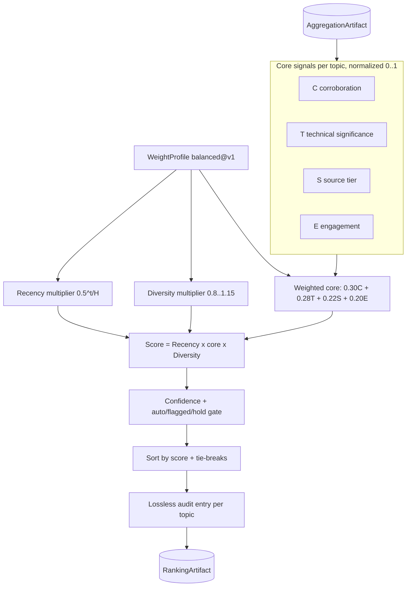
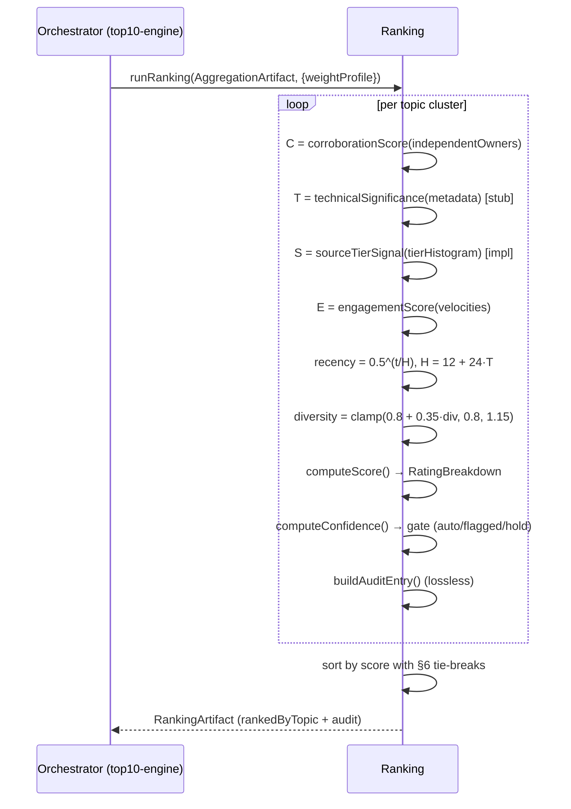

# ardur-ranking-engine — Design Specification

Schema version: `ardur-content-pipeline/v1` · Stage 2 of 4 · Status: **finalized model · scaffold**

Authoritative model: `~/Documents/Ardur-AI-Website/news-rating-system.md`. This
document threads that model into the engine. Where the model's math is
implemented it is noted **[impl]**; where extraction is still stubbed, **[stub]**.

---

## 1. Architecture overview

The ranking engine is a **pure, deterministic function**:
`RankingArtifact = rank(AggregationArtifact, WeightProfile)`. It performs no
network I/O and has **no paid-API dependency**. We rank **topics** (clusters of
independent articles about one story), not individual articles. For each topic it
extracts four normalized core signals, applies two multipliers, derives a
separate confidence value that drives an editorial gate, sorts with a
deterministic tie-break cascade, and emits a lossless audit trail. Same artifact
+ profile ⇒ same ranking; every score is offline-recomputable from its audit
entry. An LLM may enrich (NER, near-dup merge, label/take polish) but is never
required — on failure the deterministic path still ships a full Top-10.



## 2. Data flow



## 3. Data schemas

Shared types in [`../src/contracts.ts`](../src/contracts.ts) (identical across
all four repos — **not edited here**). Engine-internal model types in
[`../src/score.ts`](../src/score.ts) and [`../src/weights.ts`](../src/weights.ts).

### `RawSignals` (engine-internal) — the four core signals
`corroboration` (C), `technicalSignificance` (T), `sourceTier` (S),
`engagement` (E), each ∈ [0,1].

### `RatingBreakdown` (engine-internal) — the lossless score record
`signals` (RawSignals), `weights` (CoreWeights), `weightedCore` (Σ wᵢ·signalᵢ),
`recency` and `diversity` multipliers, and `total = recency × weightedCore ×
diversity`.

### `ScoreBreakdown` (shared contract) — projected output
`interaction` (← E), `credibility` (← S), `recency`, `diversity`,
`corroboration` (← C), `total`, and `weights` (the four core weights as a free
record). **See §10 — the contract has no typed slot for the T component value.**

### `AuditEntry` (shared contract)
`auditId`, `clusterId`, `topic`, `inputs` (the **lossless** `Record<string,
number>`: C/T/S/E, weightedCore, recency, diversity, total, independentOwners,
halfLifeHours, ageHours, confidence), `weights`, `computed` (`ScoreBreakdown`),
`rationale`, `weightProfile`, `rankedAt`.

## 4. Ranking criteria / metrics

```
Score = Recency(t) × [ 0.30·C + 0.28·T + 0.22·S + 0.20·E ] × Diversity
```

Core weights **sum to 1.0**; Recency ∈ (0,1] and Diversity ∈ [0.8,1.15] are
multipliers, so `Score ∈ [0, 1.15]`. Rank topics by `Score` descending.

| Signal | Definition | Status |
|--------|------------|--------|
| **C — Corroboration** | `min(1, ln(1+n)/ln(1+C_sat))`, `C_sat=8`, `n` = independent source **owners** (registrable domain + ownership map, tier ≥ T3). n=1→0.32, n=3→0.63, n=8→1.0. | curve **[impl]**, owner-count **[stub]** |
| **T — Technical significance** | max matched rule over CVE severity (CISA KEV / CVSS / EPSS), new-project/GA, semver release type, standard/spec change, press release; **+0.1** AI/platform-eng lean; clamp [0,1]. | rule table **[stub]** |
| **S — Source tier** | `0.7·maxTier + 0.3·meanTier`; tier values T1 1.0 / T2 0.7 / T3 0.4 / T4 0.15. Rewards a primary anchor **and** broad credible pickup. | **[impl]** from `tierHistogram` |
| **E — Engagement** | per platform: `min(cap_p, velocity_p / baseline_p)`; `E = min(1, mean over platforms with data)`. No data → `E = 0`. Velocity over a window, not totals. | cap/mean **[impl]**, baselines **[stub]** |

### Recency decay (§2.3 of the model)

```
H(T) = 12 + 24·T   hours        (half-life: 12h trivial → 24h base → 36h critical)
Recency(t) = 0.5^( t / H(T) )
```

`t` = hours since the topic's **freshest corroborating item** (not the lead), so
re-corroboration resets decay — an actively developing story stays fresh.

| Age t | Trivial H=12 | Base H=24 | Critical H=36 |
|------:|:---:|:---:|:---:|
| 6h | 0.71 | 0.84 | 0.89 |
| 12h | 0.50 | 0.71 | 0.79 |
| 24h | 0.25 | 0.50 | 0.63 |
| 48h | 0.06 | 0.25 | 0.40 |

### Diversity multiplier

```
Diversity = clamp(0.8 + 0.35·div, 0.8, 1.15)
```
`div` = normalized entropy of the owner distribution, scaled by the number of
distinct source **types** (official / press / community). Single-owner or
single-type → echo penalty (< 1.0); broad spread → up to 1.15. **[impl]** clamp,
**[stub]** entropy extraction.

### Weight profiles
Profiles are **pure data** (`weights.ts`), identified `name@vN`. `balanced@v1`
carries the approved values verbatim. Adding/changing a profile is a versioned,
reviewable data change — never a code change to the scoring math. All §2.11
knobs live here (weights, `C_sat`, half-life `H_min/H_span`, similarity θ, window
W, tier values + taxonomy map, per-platform caps, confidence weights/thresholds,
promotion floor, tie-break ε).

## 5. Confidence & editorial gate (§2.7)

Confidence answers "how sure are we this is one real, important topic," separate
from score:

```
Confidence = 0.35·C + 0.30·tierConf + 0.20·cohesion + 0.15·agreement
```
- `tierConf` = 1.0 if a Tier-1 primary is present, else `maxTier` value.
- `cohesion` = mean intra-cluster similarity (singleton → 1.0).
- `agreement` = low when engagement is high but corroboration ≈ 0 (manipulation / lone viral take).

| Confidence | Status | Behavior |
|---|---|---|
| ≥ 0.66 | `auto` | auto-publish |
| 0.40–0.66 | `flagged` | publish with a review badge |
| < 0.40 | `hold` | held in review; not shown until an editor approves |

`computeConfidence` / `confidenceStatus` are **[impl]**; `cohesion`/`agreement`
extraction is **[stub]**. The shared `Confidence` enum is gate-aligned via
`toConfidenceLabel` (auto→high, flagged→medium, hold→low).

## 6. Tie-breaking (§2.6) **[impl]**

When `|ΔScore| < ε` (ε = 0.01), order by, in turn: (1) more independent owners,
(2) max source tier, (3) technical significance, (4) freshest corroboration
timestamp, (5) a stable hash of the topic key (prevents cycle-to-cycle flapping).
See `compareForRank`.

## 7. Audit trail **[impl]**

Every topic yields exactly one `AuditEntry`. Because the shared `ScoreBreakdown`
can't carry the **T** component value, the audit `inputs` record is the
**lossless** truth — every signal (incl. T), both multipliers, the recency inputs
(owners / half-life / age), `total`, and confidence. Reproducibility invariant
(asserted in `model.test.ts`):

> `computeScore(signalsFrom(inputs), multipliersFrom(inputs),
> getWeightProfile(weightProfile)).total === inputs.total`

`auditId` is a deterministic FNV-1a hash of `(profile, clusterId, total)`;
`explainRanking` produces a stable one-line rationale.

## 8. Anti-gaming (§2.8) **[impl, with stubbed inputs]**

- **Count owners, not URLs** — corroboration/diversity dedup by registrable
  domain + ownership, so syndication/self-citation count once.
- **Velocity caps + baselines** — engagement is normalized to a rolling
  per-platform baseline and capped, so one brigaded thread can't dominate.
- **Engagement is necessary-not-sufficient** — a topic needs **≥2 independent
  owners OR a Tier-1 primary** to be Top-10-eligible (`isEligibleForTop10`).
- **Diversity echo-penalty** pushes single-owner clusters below 1.0.
- **Deterministic hashing** in tie-breaks prevents rank flapping.

## 9. Error handling, monitoring, fallback

- **Total function**: malformed/empty clusters score 0 with a `warning`, never
  throw mid-run.
- **Missing signals**: absent metrics use a documented neutral floor (engagement
  → 0; others recorded in `inputs` so the gap is auditable).
- **LLM fallback**: enrichment failure or budget exhaustion → deterministic
  labels/keys; the Top-10 still ships.
- **Monitoring**: per-topic score distribution, gate mix (auto/flagged/hold),
  fraction `single source`, and the weight-profile id. Distribution shifts flag
  upstream coverage problems.

## 10. Performance / scalability / latency

- **p95 ≤ 60 s** per cycle — pure in-memory compute over a few thousand topics.
- O(N) in topic count; trivially parallelizable per topic.
- No external dependencies in the core path → no rate limits or network variance.

## 11. Security + data provenance

- Consumes only aggregate, PII-free signals + public counts; emits none.
- Copyright-safe: metadata + extracted labels + links only, never bodies.
- The audit trail is the provenance record — every rank ties to concrete,
  inspectable inputs and named weights. Smallest attack surface in the pipeline.

## 12. Contract reconciliation (shared `contracts.ts` is authoritative)

The finalized model has a **fourth weighted core signal — Technical significance
(T, weight 0.28)** — and treats recency/diversity as multipliers. The shared
`ScoreBreakdown` has `{interaction, credibility, recency, diversity,
corroboration, total, weights}` — no typed slot for the T component value.

- We **do not** edit the shared `contracts.ts` here.
- `toScoreBreakdown` maps faithfully: C→`corroboration`, S→`credibility`,
  E→`interaction`, plus the recency/diversity multipliers and all four core
  **weights** (including `technicalSignificance`) in the free `weights` record.
- The **T value** is preserved losslessly in the audit `inputs`.
- A proposal to add `technicalSignificance` to `ScoreBreakdown` (and a richer
  gate status) is filed as an issue for cross-repo, lockstep contract revision.

## 13. Open questions (tracked as issues)

- Source-ownership registry: maintenance + the taxonomy→tier map.
- Velocity baselines across very different topic volumes.
- Cohesion/agreement estimation without an LLM (deterministic similarity).
- Whether to expose multiple weight profiles to A/B the Top-10 mix.
