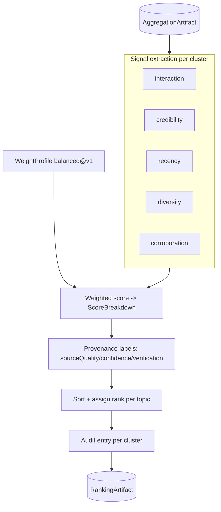
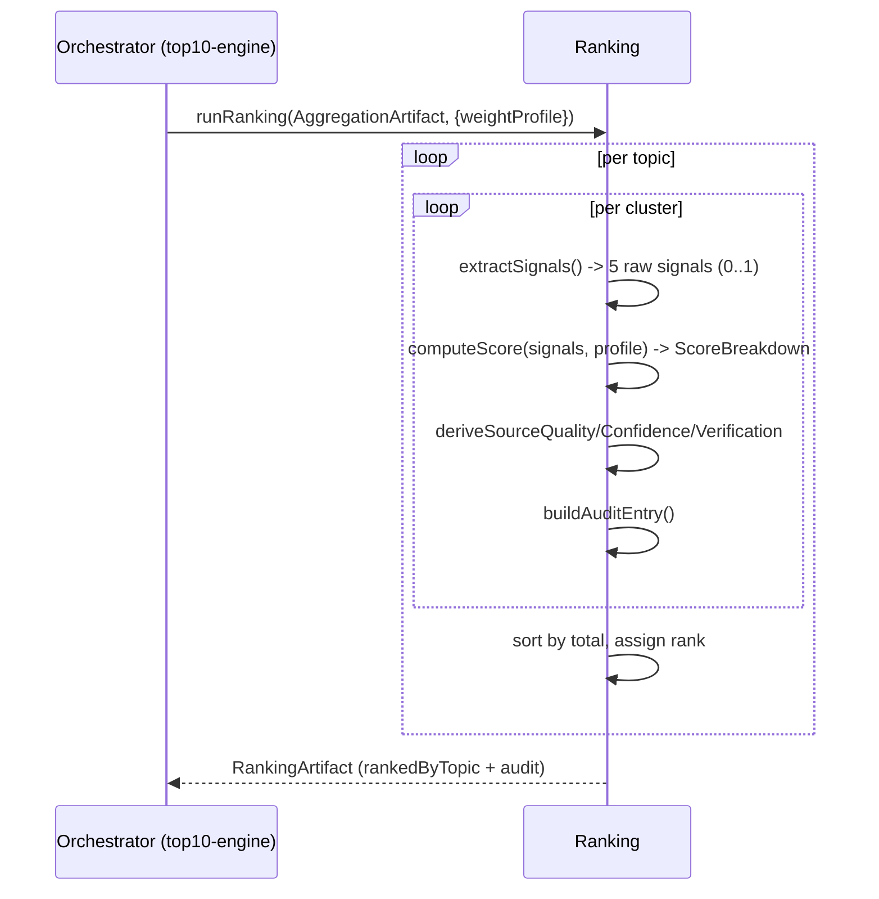

# ardur-ranking-engine — Design Specification

Schema version: `ardur-content-pipeline/v1` · Stage 2 of 4 · Status: **spec + scaffold**

---

## 1. Architecture overview

The ranking engine is a **pure, deterministic function**:
`RankingArtifact = rank(AggregationArtifact, WeightProfile)`. It performs no
network I/O and makes no AI calls. For each topic it extracts five normalized
signals per cluster, combines them under a named weight profile, sorts, assigns
ranks, and emits a complete audit trail. Determinism is the point: the same
artifact + profile always yields the same ranking, and every score is offline-
recomputable from its audit entry.

## 2. Data flow

## 3. Data schemas

Authoritative types in [`../src/contracts.ts`](../src/contracts.ts).

### `ScoreBreakdown`
`interaction`, `credibility`, `recency`, `diversity`, `corroboration`, `total`,
and `weights` (the exact weights applied). The five components are weighted
contributions; `total` is their sum.

### `RankedCluster`
Carries forward cluster identity (`clusterId`, `headline`, `memberIds`,
`sourceCount`, `distinctDomains`, `tierHistogram`, time span) plus `rank`,
`score`, `sourceQuality`, `confidence`, `verification`, and `auditId`.

### `AuditEntry`
`auditId`, `clusterId`, `topic`, `inputs` (raw signal values), `weights`,
`computed` (`ScoreBreakdown`), `rationale`, `weightProfile`, `rankedAt`.

## 4. Ranking criteria / metrics

Each signal is normalized to **0..1** before weighting:

| Signal | Definition | Source of truth |
|--------|------------|-----------------|
| **interaction** | Blend of inverse feed rank, cross-source mentions, and velocity. | `InteractionMetrics` from aggregator. |
| **credibility** | Tier-weighted average over distinct member sources (primary > paper > news > technical-news > security-news, configurable). | `tier` + `tierHistogram`. |
| **recency** | Exponential decay from `latestPublishedAt` over `recencyWindowHours`. | port of `refresh-news.mjs` recency term. |
| **diversity** | Distinct domains and tier spread relative to the topic's diversity floor. | `distinctDomains`, `tierHistogram`. |
| **corroboration** | Count of distinct independent sources reporting the story, saturating. | `sourceCount`. |

`total = Σ weightᵢ · signalᵢ`. Weights come from the active `WeightProfile`.

### Weight profiles

- Profiles are **pure data** (`weights.ts`), identified `name@vN`.
- `balanced@v1` is seeded from existing emphasis: interaction- and corroboration-
  forward, recency as a strong tiebreaker (derived from `scoreWeights` and
  `scoreItem`).
- Adding/changing a profile is a versioned, reviewable data change — never a code
  change to the scoring math.

### Provenance labels (ported from `build-news-digests.mjs`)
- `sourceQuality`: `corroborated` (≥2 distinct, ≥1 trusted) → `multi-source`
  (≥2 distinct) → `single trusted source` → `single source`.
- `confidence`: `high` (≥3 sources) / `medium` (≥2) / `low` (1).
- `verification`: `multi-source` vs `single-source`.

## 5. Audit trail

Every cluster yields exactly one `AuditEntry` capturing raw inputs, the weight
profile + weights, the computed breakdown, and a one-line rationale (e.g.
*"corroborated by 4 sources across 3 tiers, fresh (2h), high interaction"*). The
invariant: **`computeScore(entry.inputs, profile(entry.weightProfile)) ===
entry.computed`**. A conformance test should assert this for the whole artifact.

## 6. Error handling, monitoring, fallback

- **Total function**: malformed or empty clusters score 0 with a `warning`,
  never throw mid-run.
- **Missing signals**: absent optional metrics (e.g. no engagement counts) treat
  that signal as its neutral floor, recorded in `inputs` so the gap is auditable.
- **Monitoring**: per-topic score distribution, fraction of `low` confidence,
  fraction `single source`, and weight-profile id. Sudden distribution shifts
  flag upstream coverage problems.

## 7. Performance / scalability / latency

- **p95 ≤ 60 s** per cycle — pure in-memory compute over a few thousand clusters.
- O(N) in cluster count; trivially parallelizable per topic.
- No external dependencies, so no rate limits or network variance.

## 8. Security + data provenance

- Consumes only aggregate, PII-free signals from the aggregator; emits none.
- The audit trail is the provenance record: it ties every rank to concrete,
  inspectable inputs and named weights — defensible and explainable.
- No secrets, no network, no AI — the smallest attack surface in the pipeline.

## 9. Migration from `ardur.ai/main`

1. **Split `scoreItem()`** (`refresh-news.mjs`) into discrete `recencySignal` +
   `interactionSignal`; drop the magic constants into `balanced@v1`.
2. **Adopt `scoreWeights`** (`refresh-article-intelligence.mjs`) as the seed
   weight vector.
3. **Lift `sourceQuality()` / `confidenceFromReferences()`**
   (`build-news-digests.mjs`) into `score.ts` unchanged.
4. **Add the audit layer** — new in the standalone engine; the monolith computed
   scores but never persisted the rationale.
5. Output `RankingArtifact` is a superset of what the top-N selection currently
   reads inline, so the top10-engine can consume it directly.

## 10. Open questions (tracked as issues)

- Tier credibility weights: static config vs periodically recalibrated.
- Velocity normalization across very different topic volumes.
- Whether to expose multiple profiles to A/B the Top-10 mix.
